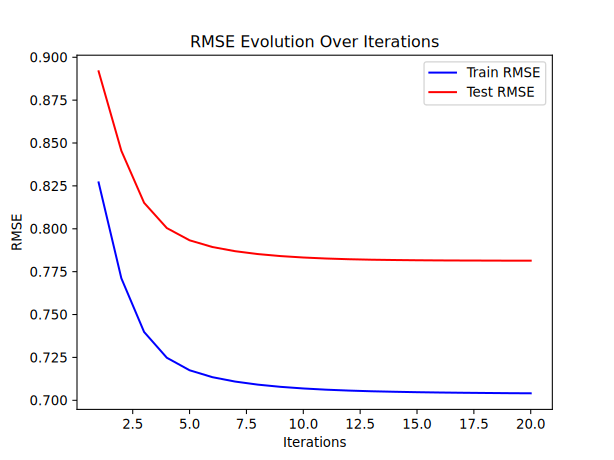
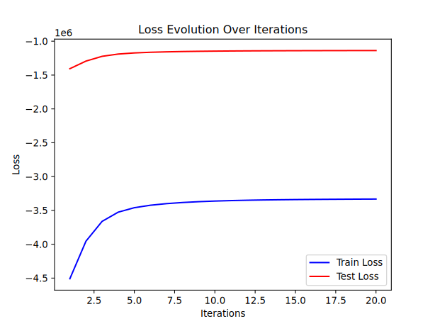

This project demonstrates the development of a **recommender system** leveraging **matrix factorization** techniques at first glance. The **Alternating Least Squares (ALS)** algorithm has been implemented, enabling user-item rating predictions. It has been validated using the **MovieLens dataset**, showcasing good performance and adaptability to real-world scenarios.

---

# Recommender System 


Or download  the  or go and test it in live on  (it may take some time to load...).


## Table of Contents

<details>
<summary><i>collapse</i></summary>


- [Recommender System Codebase](#recommender-system-codebase)
  - [Table of Contents](#table-of-contents)
  - [Introduction](#introduction)
  - [Key Features](#key-features)
  - [Algorithms](#algorithms)
    - [Alternating Least Squares (ALS)](#alternating-least-squares-als)
      - [Workflow](#workflow)
      - [Advantages](#advantages)
  - [Datasets](#datasets)
  - [Installation](#installation)
  - [Usage](#usage)
  - [Performance](#performance)
    - [Results (Example)](#results-example)
  - [Code Structure](#code-structure)
  - [Limitations](#limitations)
  - [Improvements](#improvements)
  - [Resources](#resources)
  - [License](#license)
  - [Feedbacks](#feedbacks)

</details>

---

## Introduction

This project is designed to showcase accurate and scalable recommendations using collaborative filtering. Powered by the **ALS algorithm** , the system offers strong generalization capabilities.

The codebase is crafted with a focus on **modularity** and **reusability** and **extensibility** in mind.

---

## Key Features

- **Scalable Design**: Handles datasets with millions of user-item interactions, ensuring practical usability.
- **Performance Validation**: Tested on the **MovieLens dataset**, achieving every good prediction accuracy.
- **Extensibility**: The modular architecture supports easy integration of additional algorithms or datasets.

---

## Algorithms


### Alternating Least Squares (ALS)

**ALS** is a collaborative filtering technique based on **matrix factorization**. It models user and item interactions by discovering latent features that explain observed ratings. The algorithm alternates between optimizing user and item matrices to minimize the regularized objective function:

- Without item features modeled:
  
$$
\min_{U, V} \lambda \sum_{(i,j) \in \mathcal{R}} (r_{ij} - (U_i^T V_j + b^{(u)}_i + b^{(v)}_j))^2 + \tau (\|U\|^2 + \|V\|^2) + \gamma (\|b^{(u)}\|^2 + \|b^{(v)}\|^2)
$$

- With item features modeled:

$$
\min_{U, V} \lambda \sum_{(i,j) \in \mathcal{R}} (r_{ij} - (U_i^T V_j + b^{(u)}_i + b^{(v)}_j))^2 + \tau (\|U\|^2 + \|V\|^2) + \gamma (\|b^{(u)}\|^2 + \|b^{(v)}\|^2)
$$

Where:
- $U$: Matrix of user latent factors $n \times k$.
- $V$: Matrix of item latent factors $m \times k$.
- $F$: Matrix of feature (when item features are modeled separately) 
- $b^{(u)}$: Matrix of the user biases $1 \times k$.
- $b^{(v)}$: Matrix of the item biases $1 \times k$.
- $r_{ij}$: Observed rating for user $i$ and item $j$.
- $\lambda$: Regularization parameters accounting for the prediction residuals
- $\tau$: Regularization parameters accounting for $U$ and $V$
- $\gamma$: Regularization parameters accounting for $b^{(u)}$ and $b^{(v)}$

#### Workflow

<details>
<summary><i>collapse</i></summary>

1. Solve the optimization problem for $b^{(u)}$ keeping all the other matrices (.i.e $U$, $V$, $b^{(v)}$) fixed.

    }_i=\frac{\lambda\sum_{j\in\Omega(i)}\left(r_{ij}-\left(u_i^T&space;v_j&plus;b_j^{(v)}\right)\right)}{\lambda|\Omega(i)|&plus;\gamma})

2. Solve the optimization problem for $U$ keeping all the other matrices fixed.

    }v_j&space;v_j^T&plus;\tau&space;I\right)^{-1}\left(\lambda\sum_{j\in\Omega(i)}v_j(r_{ij}-b^{(u)}_i-b^{(v)}_j)\right))

3. Solve the optimization problem for $b^{(v)}$ keeping all the other matrices fixed.

    }_j=\frac{\lambda\sum_{i\in\Omega(j)}\left(r_{ij}-\left(u_i^T&space;v_j&plus;b_i^{(u)}\right)\right)}{\lambda|\Omega(j)|&plus;\gamma})
   
4. Solve the optimization problem for $V$ keeping all the other matrices fixed.
   - When F is modeled:
   
      }u_i&space;u_i^T&plus;\tau&space;I\right)^{-1}\left(\lambda\sum_{i\in\Omega(j)}u_i(r_{ij}-b^{(u)}_i-b^{(v)}_j)&plus;\sum_{\substack{t\in\text{features}(j)}}f_t\right))
   
   - When is not modeled:
   
      }u_i^Tu_i&plus;\tau&space;I\right)^{-1}\left(\lambda\sum_{i\in\Omega(j)}u_i(r_{ij}-b^{(u)}_i-b^{(v)}_j)\right))
   
5. (When F modeled) Solve the optimization problem for $F$ keeping all the other matrices fixed.

    }u_i&space;u_i^T&plus;\tau&space;I\right)^{-1}\left(\lambda\sum_{i\in\Omega(j)}u_i(r_{ij}-b^{(u)}_i-b^{(v)}_j)&plus;\sum_{\substack{t\in\text{features}(j)}}f_t\right))

6. Repeat until convergence.


#### Advantages

- Scalable to large datasets.
- Support for parallelization for computation performance.
- Handles sparsity in user-item interaction matrices effectively.
</details>

---

## Datasets

The folder `dataset` contains information about examples' dataset.

---

## Installation

<details>
<summary><i>collapse</i></summary>

To set up the project:

1. **Clone the repository**:
   ```bash
   git clone https://github.com/hjisaac/recommender-system.git
   cd recommender-system
   ```

2. **Install dependencies**:
   ```bash
   poetry install
   ```

3. **Run an example**:
   To run the movielens example, download the dataset from [here](https://grouplens.org/datasets/movielens/).
   Ideally, put that dataset in the example folder and change the path of rating.csv file passed to the indexer.
   And run the notebook or convert it into a python file with `nbconvert`. Or you can also just run the example.{py, ipynb} file.
   
4. **Run the streamlit example**
    The streamlit uses the model **20250112-211340_lambda0.5_gamma0.01_tau2_n_epochs20_n_factors10**

    `streamlit run interface.py`
    

</details>   

---  

## Usage

<details> 
<summary><i>collapse</i></summary>

Only collaborative filtering is implemented now, and it is encaspsulated in the class `CollaborativeFilteringRecommenderBuilder`.

   ```py
   from src.recommenders import CollaborativeFilteringRecommenderBuilder
   # ...
   # Create everything needed instance the builder (indexed_data, backend that will run the proper algorithm..)
   # ...
   # Instantiate the builder with all the necessary arguments
   recommander_builder = CollaborativeFilteringRecommenderBuilder(*args, *kwars)  
   
   # Build the recommender now by calling the build on the builder to get the recommender (Kinda an implementation of the builder design pattern).
   # This will basically train the recommendation model, so it will take some time depending on the dataset size and the parameters.
   recommender = recommander_builder.build(*args, **kwargs)
   
   # To recommend, call the recommend method of the recommender object with a list of rating. E.g: [(item1, rating1), ..]
   recommender.recommend(input_ratings)
   
   # If called without arguments, the recommender will recommend best rated items.
   recommender.recommend()
   ```

   The script outputs RMSE and Loss values for both training and testing, providing insight into the system's predictive accuracy.
    And those values can be accessed later from the model and be plotted using the graphing utils if the model has been saved 
    (to save the model as checkpoint, one can pass `save_checkpoint=True` to the backend object used to do the training). There are 
   also some logs that will be generated in the `artifacts/logs` folder each time the backend runs. Those logs can be very usefull
    for debugging purposes.

</details>

---

## Performance

The first example implemented to access performance uses the [**MovieLens dataset**](https://grouplens.org/datasets/movielens/).

**Root Mean Squared Error (RMSE)** is used as the primary evaluation metric:

$$
RMSE = \sqrt{\frac{1}{n} \sum_{(i,j) \in \mathcal{R}} (r_{ij} - \hat{r}_{ij})^2}
$$

Where:
- $r_{ij}$: Actual rating.
  
- $\hat{r}_{ij} = U_i^T V_j + b^{(u)}_i + b^{(v)}_j$: Predicted rating.

### Results (Example)

This table shows the tried parameters and the related results.

| Sample size | $\beta$   | $\lambda$ | $\gamma$ | $\tau$ | $k$  | Epochs | RMSE Train   | RMSE Test    | Loss Train       | Loss Test        | Recommendation                                      |
|-------------|-----------|-----------|----------|--------|------|--------|--------------|--------------|------------------|------------------|-----------------------------------------------------|
| 1,000,000   | None      | 5         | 0.2      | 0.5    | 10   | 10     | 0.6398357382 | 0.9573722035 | -859437.8237     | -497705.9132     | Not good                                            |
| 1,000,000   | None      | 0.5       | 0.01     | 0.4    | 10   | 20     | 0.6345867557 | 0.8798720925 | -87902.6796      | -45921.5971      | Not good                                            |
| 1,000,000   | None      | 1         | 0.04     | 0.4    | 10   | 20     | 0.6301793968 | 0.9039692663 | -171394.7980     | -94303.5198      | Not good                                            |
| 1,000,000   | None      | 0.5       | 0.1      | 0.1    | 10   | 20     | 0.6281751607 | 0.921288     | -90251.1060      | -53596.0488      | Not good                                            |
| 1,000,000   | None      | 0.1       | 0.1      | 0.1    | 10   | 20     | 0.6387279301 | 0.8667931235 | -23797.7348      | -15022.7668      | Not good                                            |
| 32,000,204  | None      | 5         | 0.2      | 0.5    | 10   | 10     | 0.7002276159 | 0.8106347909 | -32134423.5451   | -11279037.9697   | Not good                                            |
| 32,000,204  | None      | 0.1       | 0.01     | 0.1    | 10   | 20     | 0.6974530613 | 0.7876710025 | -662039.0551     | -237845.6851     | Can capture some same genre movies                  |
| 32,000,204  | None      | 0.1       | 0.1      | 0.1    | 10   | 20     | 0.7005592936 | 0.791084577  | -805758.7356     | -377689.7136     | Can capture some same genre movies                  |
| 32,000,204  | 10        | 0.1       | 0.1      | 0.1    | 30   | 20     | 0.6001383912 | 0.8438440669 | -636944.0774     | -403691.8737     | Can capture same movies saisons and genres          |
| 32,000,204  | 10        | 0.5       | 0.01     | 0.5    | 10   | 20     | 0.6975553770 | 0.7890316677 | -3210830.2328    | -1092998.8915    | Can capture some same genre movies                  |
| 32,000,204  | 0.1       | 0.5       | 0.01     | 2      | 10   | 20     | 0.7040819727 | 0.781400124  | -3332430.7169    | -1137663.3828    | Can capture some same genre movies                  |
| 32,000,204  | 10        | 0.1       | 0.1      | 0.1    | 30   | 20     | 0.5656629475 | 0.8762468276 | -586130.365640   | -422391.191275   | Can capture same movies saisons and genres          |
| 32,000,204  | 1000      | 0.1       | 0.1      | 0.1    | 30   | 20     | 0.6007653637 | 0.839526128  | -622068.9192116  | -385560.61266044 | Can capture same movies saisons and genres          |	

Here are the RMSE and Loss curves of the model **20250112-211340_lambda0.5_gamma0.01_tau2_n_epochs20_n_factors10**. 

#### RMSE Curve



- RMSE Train: 0.7814
- RMSE Test:  0.7041

For the other models, we got approximately the same curve shape and a similar RMSE value.

#### Loss Curve



For the other models, we got approximately the same curve shape and a similar loss value.


### Recommendation

Here are the returned recommendations for the movie `Harry Potter 20th Anniversary: Return to Hogwarts (2022) - Documentary` rated at 5 using the model **20250117-073926_lambda0.1_gamma0.1_tau0.1_n_epochs20_n_factors30** :

1. *Louis C.K.: Shameless* (2007) – Comedy
2. *Louis C.K.: Chewed Up* (2008) – Comedy
3. *Louis C.K.: Hilarious* (2010) – Comedy
4. *Harry Potter 20th Anniversary: Return to Hogwarts* (2022) – Documentary
5. *Louis C.K.: Live at The Comedy Store* (2015) – Comedy
6. *Jackass Number Two* (2006) – Comedy | Documentary
7. *Jackass 3D* (2010) – Action | Comedy | Documentary
8. *Harry Potter and the Deathly Hallows: Part 2* (2011) – Action | Adventure | Drama | Fantasy | Mystery | IMAX
9. *Harry Potter and the Deathly Hallows: Part 1* (2010) – Action | Adventure | Fantasy | IMAX
10. *Harry Potter and the Half-Blood Prince* (2009) – Adventure | Fantasy | Mystery | Romance | IMAX

#### Latent space


These results demonstrate the model's ability to generalize well to unseen data, confirming its practical applicability.
We can obviously do better with more parameter space exploration.

---

## Code Structure
<details>
<summary><i>collapse</i></summary>

```txt
artifacts/            # Stores generated artifacts such as model checkpoints, logs, and profiling data.
├── checkpoints/      # Saved model checkpoints for resuming or fine-tuning training.
│   └── als/          # Checkpoints for the ALS algorithm specifically.
│       ├── 1000000   # Checkpoint for ALS with 1 million interactions as limit of lines to load.
│       └── 100000000 # Checkpoint for ALS with 100 million interactions as limit of lines to load.
├── figures/          # Contains visualizations or figures generated during the project (for analysis and results...).
└── logs/             # Logging files generated during training or testing.

datasets/             # Documentation about the datasets used for training and evaluation of the recommender system.

docs/                 # Documentation for the project, including detailed explanations and guidelines.

examples/             # Example scripts to demonstrate the usage of the system.
├── basic_example/    # A simple example to get started quickly.
└── movies_lens/      # Example using the MovieLens dataset.

figures/              # Additional plots and figures for analysis and results.

src/                  # Source code for the project, organized by functional modules.
├── algorithms/       # Implementation of recommender system algorithms.
│   └── core/         # Implementation of the base logics common to all the recommender algorithms.
├── backends/         # Backend modules for database access, API integrations, etc.
├── helpers/          # Utility functions and helpers for common tasks.
├── recommenders/     # High-level classes to encapsulate recommendation pipelines.
├── settings/         # Configuration files for the project.
└── utils/            # General-purpose utilities used throughout the codebase.

tests/                # Test suite for validating the functionality of the project.
├── backends/         # Tests specific to backend modules.
├── fixtures/         # Sample test data or configurations for consistent testing.
├── helpers/          # Tests for utility functions and helpers.
│   └── test_checkpoints/ # Tests for the checkpoint loading and saving functionality.
└── utils/            # Tests for utilities used across the codebase.


```

</details>


---

## Limitations 

<details> 
<summary><i>collapse</i></summary>

Running the MovieLens example (32 million ratings) takes approximately 3 hours on CPU alone.

The early use of `SerialUnidirectionalMapper` and `SerialBidirectionalMapper` data structures 
complicates integrating [Numba](https://numba.pydata.org/). These classes lack clear type specifications, making it nearly 
impossible to leverage **Numba**'s optimization capabilities. To use Numba effectively, we would 
need to remove these data structures from the code. There is an issue opened to fix that.

</details>

## Improvements

<details> 
<summary><i>collapse</i></summary>

- **Integration of Additional Algorithms**: Incorporate other collaborative filtering and content-based methods.
- **Hybrid Recommender Systems**: Combine collaborative and content-based filtering for improved performance.
- **More Examples**: Implement more examples potentially with different datasets for real-time recommendations.
- **Numba and Jax**: Currently it is not possible to use numba/jax, cause the code contains a lot of custom objects. Plan a fix.
- **Issues**: Resolve the remaining issues, including the adding of unit tests.
- **Comparison**: Compare with existing libraries.

---

</details>

## Resources

<details open> 
<summary><i>collapse</i></summary>

The `docs` folder contains useful resources (papers, ...)

</details>

---
## License

This project is licensed under the MIT License. See the `LICENSE` file for more details.

## Feedbacks

Feel free to give any feedback or report any issues to me [<hjisaac.h at gmail.com>](hjisaac.h@gmail.com). 


